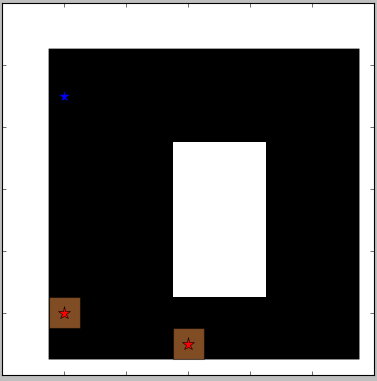

### Multi-Agent Deep Reinforcment Learning

This is the multi-agent section of the Reinforcement Learning repository available at https://github.com/dhavalsalwala/rl-algos

### Environment description
  
  - Pursuit Evasion
 

  
  
Pursuit is a standard task for benchmarking multi-agent algorithms. The pursuit-evasion domain consists of two sets of agents: evaders and pursuers. The evaders are trying to avoid pursuers, while the pursuers are trying to catch the evaders. The action and observation spaces in this problem are discrete. The agents interact on a two-dimensional grid, and an evader is considered caught if it is surrounded by pursuers on four sides. In order to catch the evaders, the pursuers must learn to cooperate by trapping the evaders on all sides. When the pursuers catch an evader, they receive a reward. The evaders follow a uniform random policy. The domain contains obstacles through which the agents cannot pass. Each pursuer receives a range-limited observation of its surroundings, and must choose between five actions Stay, Go East, Go West, Go South, Go North. The observations contain information about the agent’s surroundings, including the location of nearby pursuers, evaders, and obstacles.

  
### Setup
  - Add directories to PYTHONPATH
            
        export PYTHONPATH=$(pwd):$(pwd)/modules/MADRL:$(pwd)/modules/MADRL/rltools:$(pwd)/modules/MADRL/rllab:$PYTHONPATH
  
### RL Algos
  - DQN
  
        python3 rltechniques/multi_agent/dqn/run_pursuit.py --algo=dqn --control decentralized --policy_hidden 100,50,25 --n_iter 10 --batch_size 32 --replay_pre_trained_size 1000 --conv True --batch_normalization True
  
  - REINFORCE
  
        python3 rltechniques/multi_agent/policy_gradient/run_pursuit.py --algo=vpg --control decentralized --policy_hidden 100,50,25 --n_iter 1000 --batch_size 1000
        
### References

  - K. Gupta, Jayesh & Egorov, Maxim & Kochenderfer, Mykel. (2017). Cooperative Multi-agent Control Using Deep Reinforcement Learning. 66-83. 10.1007/978-3-319-71682-4_5. 
  - Lowe, Ryan & Wu, Yi & Tamar, Aviv & Harb, Jean & Abbeel, Pieter & Mordatch, Igor. (2017). Multi-Agent Actor-Critic for Mixed Cooperative-Competitive Environments. 

